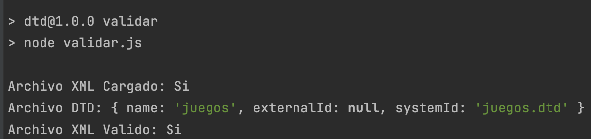

# Actividad 2: DTD
## UNIR Practica
### Lenguajes, Estándares y Tecnologías para la Web (MEXINGWEB)

- [Link a XML](https://github.com/JC-LG/xml-dtd/blob/master/juegos.xml)
- [Link a DTD](https://github.com/JC-LG/xml-dtd/blob/master/juegos.dtd)

